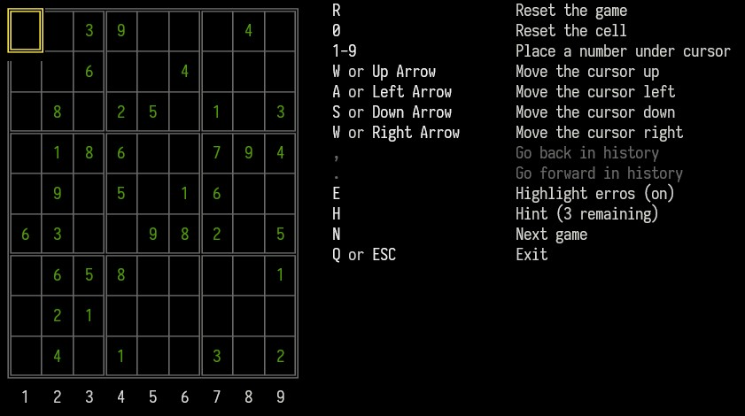

# Sudoku Clone for Terminal Nerds



## Quick Start

A [Sudoku](https://en.wikipedia.org/wiki/Sudoku) game demo written in [C#](https://learn.microsoft.com/en-us/dotnet/csharp/) so make sure you have .NET installed before trying to build/run the demo.

## Building 
```console
$ dotnet build
```

## Running the demo
```console
$ dotnet run --project Virgee.Sudoku.Demo/Virgee.Sudoku.Demo.csproj 
```

## Controls
| key                                                 | description        |
|-----------------------------------------------------|--------------------|
| <kbd>w</kbd>,<kbd>a</kbd>,<kbd>s</kbd>,<kbd>d</kbd> or <kbd>up</kbd>,<kbd>left</kbd>,<kbd>down</kbd>,<kbd>right</kbd> | Move cursor around |
| <kbd>R</kbd>                                    | Reset the game         |
| <kbd>0</kbd>                                        | Reset the cell   |
| <kbd>1-9</kbd>                                        | Place a number under cursor               |
| <kbd>,</kbd>                                        | Go back in history               |
| <kbd>.</kbd>                                        | Go forward in history               |
| <kbd>E</kbd>                                        | Highlight erros (on by default)               |
| <kbd>H</kbd>                                        | Hint (3 available)               |
| <kbd>N</kbd>                                        | Next game |
| <kbd>Q</kbd> or <kbd>ESC</kbd>                                        | Exit |

### **BE AWARE OF THE MINES**
Tapping a cell that contains a mine will make it explode and you'll die. 
Please, tap responsibly.
